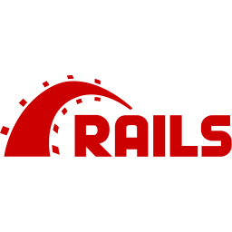

<!-- TODO: Finish this readme before push to github -->
<!-- Project Shields -->

[![Contributors][contributors-shield]][contributors-url]
[![Forks][forks-shield]][forks-url]
[![Stargazers][stars-shield]][stars-url]
[![Issues][issues-shield]][issues-url]
[![GNU License][license-shield]][license-url]
[![LinkedIn][linkedin-shield]][linkedin-url]

<br />

<p align="center">
    <a href="https://github.com/rafaelqueiroz88/rorcommerce">
        
    </a>
</p>

<br />

# Ruby on Rails Commerce

<p>
O Ruby on Rails Commerce ou internamente conhecido como RORCOMMERCE é um projeto criado por um grupo de entusiastas da comunidade Ruby on Rails com o propósito de promover o trabalho em equipe e aprendizado.
Trata-se de um Marketplace onde os usuários poderiam cadastrar seus produtos para venda enquanto que outros usuários (normalmente com perfil de cliente), poderiam fazer compras e cadastrar seus endereços para entrega.
Trata-se de uma proposta simples, porém o grupo se disponibiliza tentar fazer de forma mais completa quanto possível.
</p>
<p>
    Gostou? Entenda como colaborar, com ou sem experiência em <strong>desenvolvimento de software</strong> 
    <br />
</p>
<p align="center">
    <a  href="https://github.com/rafaelqueiroz88/rorcommerce">
        <strong>Explorar »</strong>
    </a>
</p>

<ul>
    <li>
        <!-- <a href="https://rafaelonrails.herokuapp.com/"> -->
            Quero ver estas linhas de código em ação! (Em breve)
        <!-- </a>     -->
    </li>
    <li>
        <a href="https://github.com/rafaelqueiroz88/rafaelsblog/issues">
            Vish...Encontrei uma falha...Reportar Bug!
        </a>
    </li>
    <li>
        <a href="https://github.com/rafaelqueiroz88/rafaelsblog/issues">
            Tenho uma ideia...anota aí!
        </a>    
    </li>
    <li>
        <a href="https://trello.com/b/92EMY1ti/ror-commerce">
            E tem um quadro das atividades? SIM!
        </a>    
    </li>
</ul>

<!-- TABLE OF CONTENTS -->
<details open="open">
  <summary>Conteúdo deste Documento</summary>
  <ol>
    <li>
      <a href="#acerca-do-projeto">Acerca do projeto</a>
      <ul>
        <li><a href="#tecnologias-adotadas">Tecnologias adotadas no desenvolvimento</a></li>
      </ul>
    </li>
    <li>
      <a href="#getting-started">Primeiros passos</a>
      <ul>
        <li><a href="#prerequisites">Requisitos</a></li>
        <li><a href="#installation">Instação</a></li>
      </ul>
    </li>
    <li><a href="#roadmap">Progresso</a></li>
    <li><a href="#contributing">Contribuição</a></li>
    <li><a href="#license">Licença</a></li>
    <li><a href="#ready">Tudo Pronto</a></li>
    <li><a href="#contact">Contato</a></li>
  </ol>
</details>

<br /><br />

<a id="acerca-do-projeto" ></a>

## Acerca do Projeto

<p>
Este é um projeto construído apenas para fins de aprendizado, por este motivo não há muita complexidade.
Contudo trata-se de um projeto completo onde alguns usuários (vendedores) podem cadastrar produtos (novos ou usados) para venda, enquanto que alguns usuários tem o perfil de cliente e podem comprar estes produtos e cadastrar endereços de entrega. Na sessão abaixo é possível ver que o projeto será bem completo baseado nas tecnologias incorporadas ao projeto.
</p>
<br />
<a href="tecnologias-adotadas" id="tecnologias-adotadas" ></a>

## Tecnologias adotadas no desenvolvimento

Encontre nesta sessão todas as tecnologias que foram adotadas no desenvolvimento desta aplicação seguidas de suas respectivas fontes:

* [Ruby](https://rubyonrails.org/)
* [Ruby on Rails](https://www.ruby-lang.org/pt/)
* [React](https://pt-br.reactjs.org/)
* [Redux](https://redux.js.org/)
* [Rspec](https://rspec.info/)
* [Sidekiq](https://sidekiq.org/)
* [Sidekiq-Cron](https://github.com/ondrejbartas/sidekiq-cron)
* [Redis](https://redis.io/)
* [Docker](https://www.docker.com/)
* [Postgresql](https://www.postgresql.org/)
* [Heroku](https://www.heroku.com/about)
* [AWS-S3](https://aws.amazon.com/pt/free/?s_kwcid=AL!4422!3!561843094953!p!!g!!console%20aws&trk=c623d581-46f6-43a2-b227-cabbee9cd673&sc_channel=ps&sc_campaign=acquisition&sc_medium=ACQ-P|PS-GO|Brand|Desktop|SU|AWS|Core|BR|PT|Text&ef_id=Cj0KCQiAkZKNBhDiARIsAPsk0Wj3LlVpV-8yrCBrAy2OnOv4a26uGmmAsq2q32iE2l62MiYQVf9wfHQaAm05EALw_wcB:G:s&s_kwcid=AL!4422!3!561843094953!p!!g!!console%20aws&all-free-tier.sort-by=item.additionalFields.SortRank&all-free-tier.sort-order=asc&awsf.Free%20Tier%20Types=*all&awsf.Free%20Tier%20Categories=*all)

<br />
<a href="getting-started" id="getting-started"></a>

## Primeiros passos
<p>
Para seguir com a instalação e inicialização da aplicação, será necessário fazer o *download* diretamente do Github *ou* clonar este repositório (recomendado). Além disso, é recomendado <strong>fortemente</strong> a leitura de toda a documentação antes de iniciar qualquer um dos passos listados a seguir.
</p>
<br />

Caso a opção escolhida seja o clone, execute o seguinte comando em seu terminal favorito:

```
git clone https://github.com/rafaelqueiroz88/rorcommerce
```

Acesse o diretório da aplicação e então faça a instalação das bibliotecas necessárias

<br />

Instalação das depedências
```
bundle install
```

<br />

<a href="prerequisites" id="prerequisites"></a>

## Requisitos
<p>
Antes de iniciar a aplicação, será necessário verificar se todas as dependencias estão disponíveis na máquina
</p>
* Postgresql (instalado, porém desativado caso queira usar o Docker)
* Ruby 3.0.2 (ou superior)
* Rails 6.1.4 (ou superior)
* Docker (opcional, recomendado)

<p>
<strong>O uso do Docker não é obrigatório</strong>, porém é recomendado. Este projeto está pré-configurado para rodar com o <strong>puma</strong> então caso queira utilizar o Docker aguarde a atualização da documentação ou crie um Dockerfile para implementar o servidor.
</p>
<br />

### Utilizando o puma

<p>
Para inicializar a aplicação diretamente em seu console com o servidor local, será necessário fazer algumas alterações:
</p>
* Atualizar o arquivo config/database.yml
* Inicializar o banco de dados do Postgresql

<br />

>Obs. No momento temos apenas a configuração de usuário no arquivo seed.rb, porém este arquivo pode receber atualizações ao longo do desenvolvimento da aplicação. Certifique-se de ter essas informações no banco. O comando *seed* não possui um *output*. Se nada aparecer após a execução do comando quer dizer que a execução foi um sucesso! Caso queira uma amostra visual do sucesso desta operação, utilize o console do __Rails__

<br />

<a href="roadmap" id="roadmap"></a>

## Progresso

Veja [open issues](https://github.com/rafaelqueiroz88/rafaelsblog/issues) para ver a lista de features sugeridas. Ou acompanhe as *Branchs* do projeto. Além disso é possível acessar o nosso *board* no <a href="https://trello.com/b/92EMY1ti/ror-commerce">Trello</a>

<br />
<a href="contributing" id="contributing"></a>

## Contribuições

Contribuições fazem do mundo um lugar melhor, sendo assim que tal dar aquela ajudinha? É muito simples! Basta entrar em contato conosco ou seguir este passo-a-passo. Lembre-se... **Sua ajuda será muito apreciada!**
<br />
```
1. Crie um Fork do projeto
2. Crie a sua própria branch (`git checkout -b feature/AmazingFeature`)
3. Escreva uma (ou mais) commit(s) de suas alterações (`git commit -m 'Add new feature'`)
4. Envie as atualizações para a Branch (`git push origin feature/AmazingFeature`)
5. Abra uma Pull Request para enviar suas sugestões de alteração
```

<a href="license" id="license"></a>

## Licença

Distribuído sobre a licença GNU License. Veja mais em nossa base de conhecimentos.

<br />

<a href="ready" id="ready"></a>

## Tudo pronto

Após a realização do passo-a-passo a aplicação estará disponível para acesso.
Abra o seu navegador favorito e acesse:

```
localhost:3000/
```

<a href="contact" id="contact"></a>

## Contatos

### Desenvolvedores do Projeto
<!-- TODO: AMIGO DEV. POR FAVOR COPIE O BLOCO ABAIXO E COLE INFORMANDO SEUS MEIOS DE CONTATO. OBRIGADO! -->
* [@facebook](https://www.facebook.com/rafael.queiroz.castro/)
[@linkedin](https://www.linkedin.com/in/rafael-queiroz-0074a4139/)
* rafael.qdc88@gmail.com

Projeto: [Ruby on Rails Commerce](https://github.com/rafaelqueiroz88/rafaelsblog)

<br />

[![Contributors][contributors-shield]][contributors-url]
[![Forks][forks-shield]][forks-url]
[![Stargazers][stars-shield]][stars-url]
[![Issues][issues-shield]][issues-url]
[![GNU License][license-shield]][license-url]
[![LinkedIn][linkedin-shield]][linkedin-url]

[contributors-shield]: https://img.shields.io/github/contributors/rafaelqueiroz88/rorcommerce.svg?style=for-the-badge
[contributors-url]: https://github.com/rafaelqueiroz88/rorcommerce/graphs/contributors
[forks-shield]: https://img.shields.io/github/forks/rafaelqueiroz88/rorcommerce?style=for-the-badge
[forks-url]: https://github.com/rafaelqueiroz88/rorcommerce/network/members
[stars-shield]: https://img.shields.io/github/stars/rafaelqueiroz88/rorcommerce?style=for-the-badge
[stars-url]: https://github.com/rafaelqueiroz88/rorcommerce/stargazers
[issues-shield]: https://img.shields.io/github/issues/rafaelqueiroz88/rorcommerce.svg?style=for-the-badge
[issues-url]: https://github.com/rafaelqueiroz88/rorcommerce/issues
[license-shield]: https://img.shields.io/github/license/rafaelqueiroz88/rorcommerce.svg?style=for-the-badge
[license-url]: https://github.com/rafaelqueiroz88/rorcommerce/blob/master/LICENSE
[linkedin-shield]: https://img.shields.io/badge/-LinkedIn-black.svg?style=for-the-badge&logo=linkedin&colorB=555
[linkedin-url]: https://www.linkedin.com/in/rafael-queiroz-0074a4139/